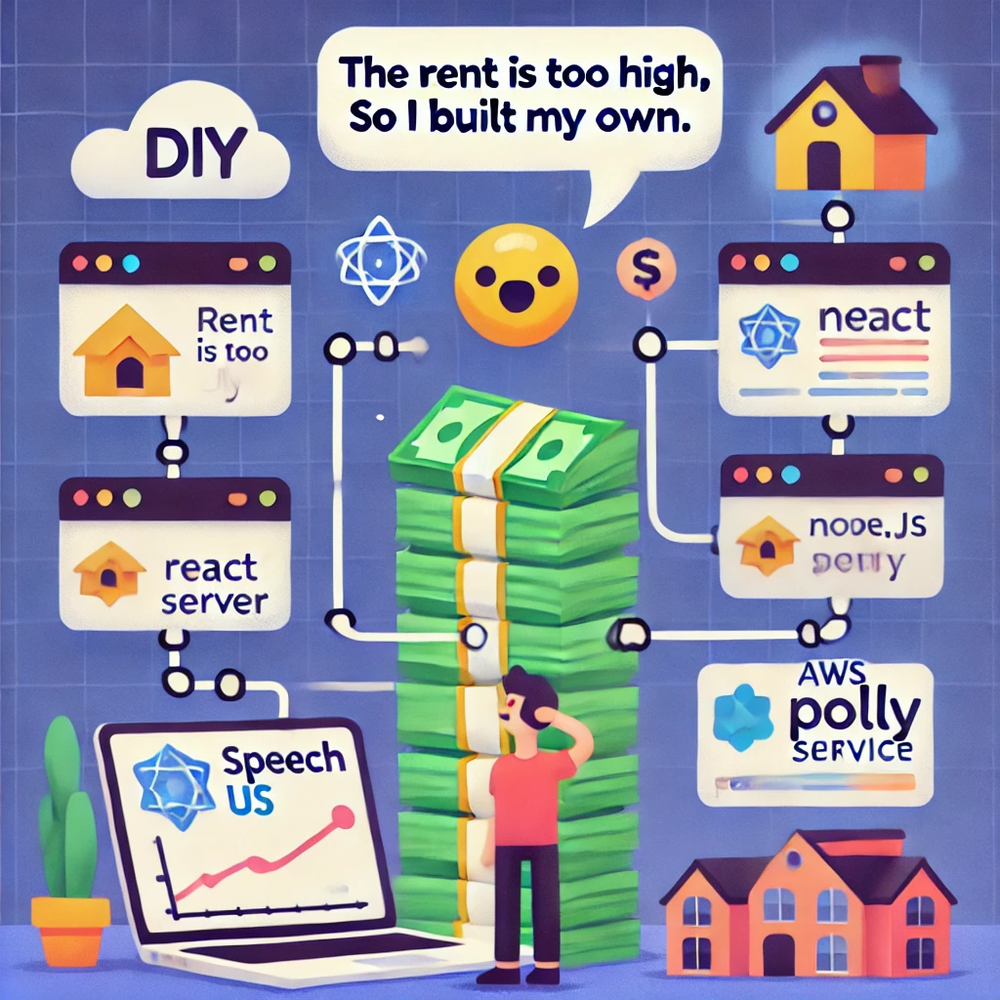
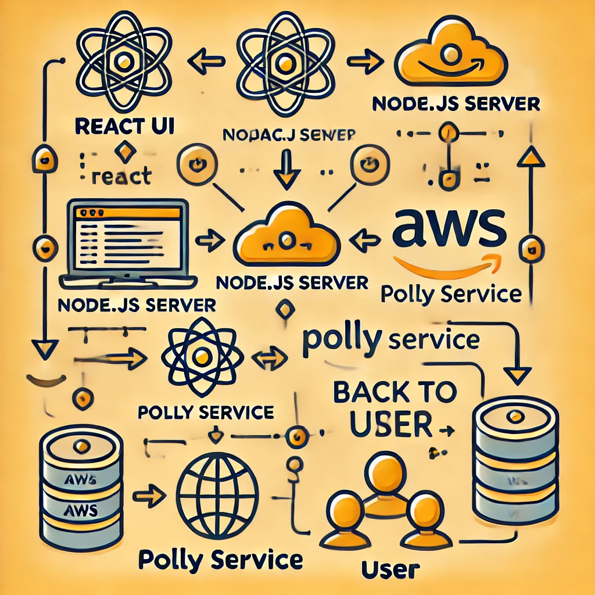

# myversionofspechify
myversionofspechify


## Audio Example

To listen to a sample audio file generated by this app, click the play button below:

<audio controls>
  <source src="audio-eb736407-41e8-48be-b8fe-29c8506101fb.mp3" type="audio/mpeg">
  Your browser does not support the audio element so just download the MP3 file in this repo and play it for an audio transcript of this page.
</audio>

## How It Works
1. **User Interface (React)**: Users can input text or upload a file, then click submit.
2. **Server (Node.js)**: The server sends the text to AWS Polly using the AWS SDK.
3. **AWS Polly**: Polly converts the text to speech and sends back an audio file.
4. **Browser Playback**: Once processed, users can play or download the audio directly in the browser.


## Concept of the App


## Application Flow Diagram



# MyVersionOfSpeechify

MyVersionOfSpeechify is a web application built using Node.js and React that allows users to upload a text file or paste text directly into the app, transforming it into spoken audio using Amazon Polly's text-to-speech capabilities. The app provides a straightforward UI to interact with AWS Polly, handling file uploads, text input, and response processing with real-time feedback.

## Features

- **Text Input and File Upload**: Users can either paste text or upload a file to be converted to speech.
- **AWS Polly Integration**: Utilizes the Amazon Polly API to convert text to audio with a variety of voices.
- **Real-Time Feedback**: Displays a processing graphic while waiting for AWS Polly's response, ensuring users know their request is being handled.
- **Downloadable Audio**: Retrieves and displays the audio file for easy playback or download.

## Technologies

- **Frontend**: React for the user interface, with a clear and responsive design to handle file input, text input, and display results.
- **Backend**: Node.js and Express.js, responsible for handling requests, connecting to AWS Polly, and returning audio results.
- **AWS SDK**: The AWS SDK is used on the backend to authenticate and interact with the Polly service, utilizing AWS environment variables for secure access.

## Getting Started

### Prerequisites

- **Node.js**: Ensure you have Node.js installed (recommended v14 or higher).
- **AWS Account**: You'll need AWS credentials with access to Polly.
- **Environment Variables**: Set up your AWS credentials in your environment to authenticate with AWS CLI.

### Installation

1. **Clone the repository**:
   ```bash
   git clone https://github.com/yourusername/myversionofspeechify.git
   cd myversionofspeechify


